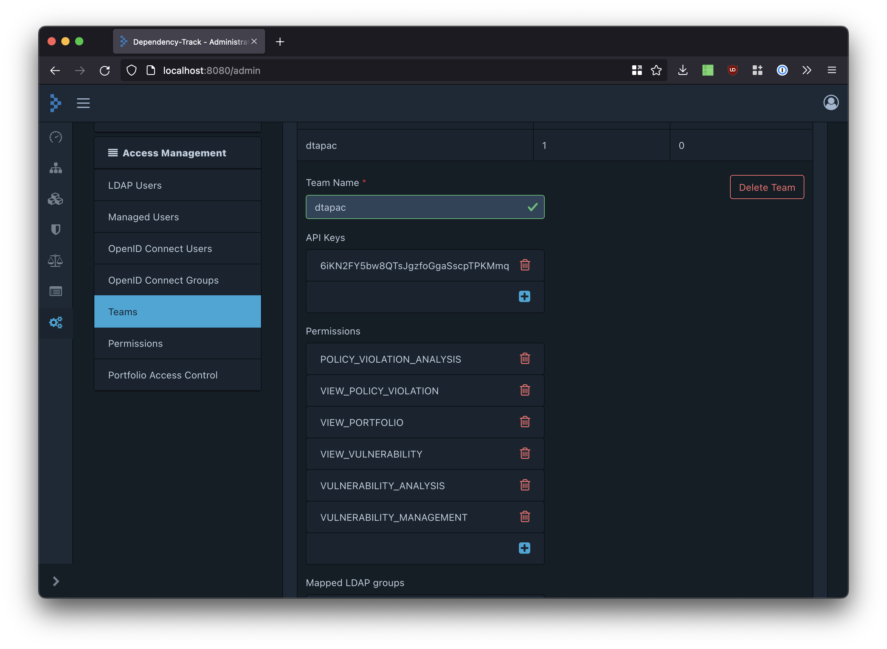
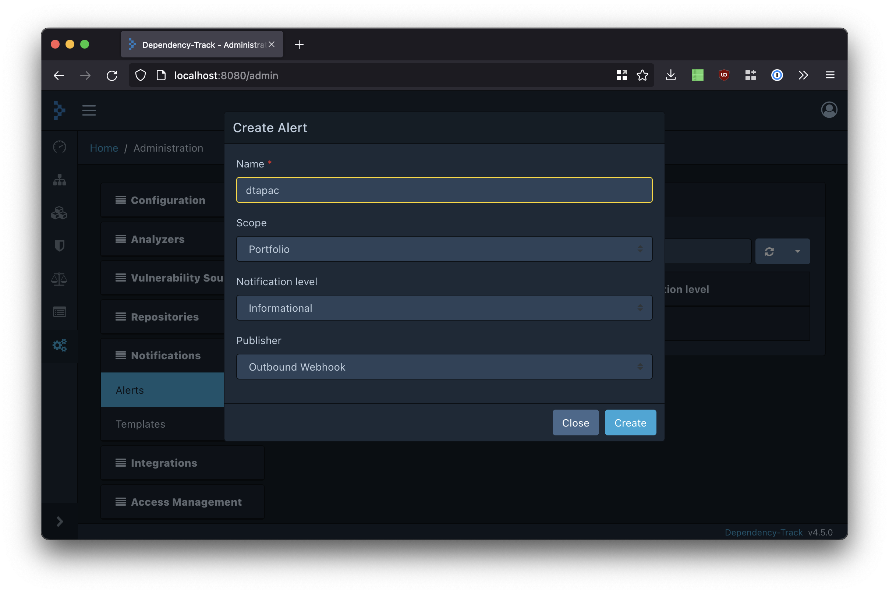
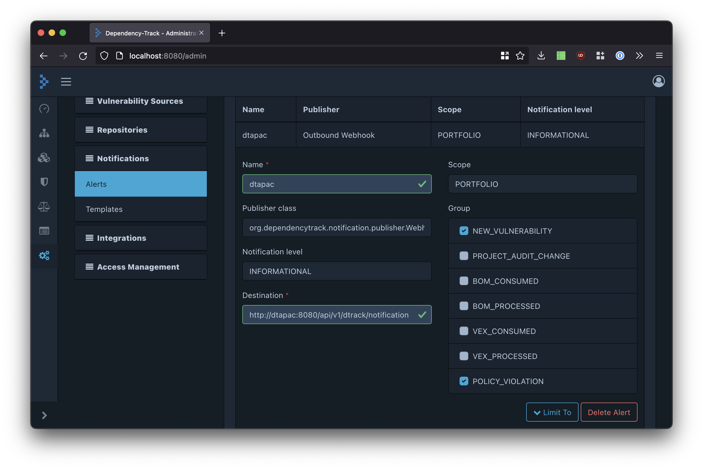

# dtapac

[](https://github.com/nscuro/dtapac/actions/workflows/ci.yml)
[](https://github.com/nscuro/dtapac/releases/latest)
[](LICENSE)

*Audit Dependency-Track findings and policy violations via policy as code*

> Consider this project to be a proof-of-concept. It is not very sophisticated, but it gets the job done.
> Try it in a test environment first. **Do not skip this step, do not run it in production without prior testing**!

## Introduction

[Dependency-Track](https://dependencytrack.org/) offers a fairly sophisticated auditing workflow for vulnerabilities 
and policy violations.

I often found myself wanting a mechanism that lets me make more generalized audit decisions that would affect
multiple (and sometimes even *all*) projects in my portfolio. While the most common use case for something like this
is definitely suppressing false positives, there are times when other audit actions are desirable as well.
A [suppression file](https://jeremylong.github.io/DependencyCheck/general/suppression.html) as seen in projects like 
[Dependency-Check](https://jeremylong.github.io/DependencyCheck/) simply won't cut it.

I've written a fair share of tools that provide the desired functionality based on some kind of configuration file 
(mostly YAML), but I quickly came to the realization that configuration files are too limiting for my needs. 
Not only are they not a good fit for dynamic decisions, they are also a pain to test.

It turns out that you can have your cake and eat it too using *policy as code*. The most popular implementation of PaC 
probably being [Open Policy Agent](https://www.openpolicyagent.org/) (OPA). 

Think of *dtapac* as a bridge between Dependency-Track and OPA.

> Note that *dtapac* as it stands now is *not* intended for performing all auditing through it. 
> Don't use it for decisions that are project-specific. Use it for decisions that are likely to affects larger
> parts of your portfolio. A few sample [use cases](#use-cases) are listed at the bottom of this document.

## How it works

### Ad-hoc auditing through notifications

The main way that *dtapac* uses to integrate with Dependency-Track is by consuming 
[notifications](https://docs.dependencytrack.org/integrations/notifications/). When receiving a `NEW_VULNERABILITY` or 
`POLICY_VIOLATION` notification, *dtapac* will immediately query OPA for an analysis decision. 

```mermaid
sequenceDiagram
    autonumber
    actor Client
    Client->>Dependency-Track: Upload BOM
    Dependency-Track->>Dependency-Track: Analyze BOM
    alt New Vulnerability identified
        Dependency-Track->>dtapac: NEW_VULNERABILITY notification
    else Policy Violation identified
        Dependency-Track->>dtapac: POLICY_VIOLATION notification
    end
    dtapac->>OPA: Query analysis decision
    OPA->>OPA: Evaluate policy
    OPA->>dtapac: Analysis decision
    dtapac->>Dependency-Track: Query existing analysis
    Dependency-Track->>dtapac: Analysis
    dtapac->>dtapac: Compare analyses
    opt Analysis has changed
        dtapac->>Dependency-Track: Update analysis
    end
```

*dtapac* will only submit the resulting analysis if it differs from what's already recorded in Dependency-Track. 
This ensures that the audit trail won't be cluttered with redundant information, even if *dtapac* receives multiple 
notifications for the same finding or policy violation.

Note  that this also means that if you make changes to an analysis that *dtapac* applied for you in Dependency-Track,
*dtapac* will override it during its next execution. This is by design.

### Portfolio auditing on policy change

If configured, *dtapac* can listen for [status updates](https://www.openpolicyagent.org/docs/latest/management-status/) 
from OPA. *dtapac* will keep track of the revision of the policy bundle, and trigger a portfolio-wide analysis when it 
changes.

```mermaid
sequenceDiagram
    autonumber
    loop Periodically
        OPA->>Nginx: Pull Bundle
        Nginx->>OPA: archive
    end
    loop Periodically
        OPA->>dtapac: Status
        dtapac->>dtapac: Compare reported bundle revision with last-known
        opt Bundle revision changed
            dtapac->>Dependency-Track: Fetch all projects
            Dependency-Track->>dtapac: Projects
            loop For each project
                dtapac->>Dependency-Track: Fetch all findings & policy violations
                Dependency-Track->>dtapac: Findings & policy violations
                loop For each finding & policy violation
                    dtapac->>OPA: Query analysis decision
                    OPA->>OPA: Evaluate policy
                    OPA->>dtapac: Analysis decision
                    dtapac->>Dependency-Track: Query existing analysis
                    Dependency-Track->>dtapac: Analysis
                    dtapac->>dtapac: Compare analyses
                    opt Analysis has changed
                        dtapac->>Dependency-Track: Update analysis
                    end
                end
            end
        end
    end
```

This makes it possible to have new policies applied to the entire portfolio shortly after publishing them, without the
need to restart any service or edit files on any server.

### Shortcomings

Some limitations of *dtapac* that you should be aware of before using it:

* **No retries**. If an analysis decision could not be submitted to Dependency-Track for any reason, it won't be retried.
* **No persistence**. If you stop *dtapac* while it's still processing something, that something is gone.
* **No access control**. *dtapac* trusts that whatever is inside the notifications it receives is valid. Notifications can be forged. Deploy *dtapac* to an internal network or use a service mesh.

## Usage

```
USAGE
  dtapac [FLAGS...]

Audit Dependency-Track findings and policy violations via policy as code.

FLAGS
  -config ...                 Path to config file
  -dry-run=false              Only log analyses but don't apply them
  -dtrack-apikey ...          Dependency-Track API key
  -dtrack-url ...             Dependency-Track API server URL
  -finding-policy-path ...    Policy path for finding analysis
  -host 0.0.0.0               Host to listen on
  -log-json=false             Output log in JSON format
  -log-level info             Log level
  -opa-url ...                Open Policy Agent URL
  -port 8080                  Port to listen on
  -violation-policy-path ...  Policy path for violation analysis
  -watch-bundle ...           OPA bundle to watch
```

## Deployment

### Get an API key

For *dtapac* to be able to use the Dependency-Track API, it needs an API key
with the following permissions:

| Permission                  | Reason                              |
|:----------------------------|:------------------------------------|
| `VIEW_PORTFOLIO`            | Fetch project + component info      |
| `VIEW_VULNERABILITY`        | Fetch findings + vulnerability info |
| `VULNERABILITY_ANALYSIS`    | Apply analyses to findings          |
| `VIEW_POLICY_VIOLATION`     | Fetch policy violations             |
| `POLICY_VIOLATION_ANALYSIS` | Apply analyses to policy violations |

It's recommended to create a dedicated team for *dtapac*, like so:



### Set up a webhook

Create a new alert with scope `Portfolio` and publisher `Outbound Webhook`:



Point the destination to *dtapac*'s `/api/v1/dtrack/notification` endpoint and enable the
`NEW_VULNERABILITY` and `POLICY_VIOLATION` groups:



Goes without saying that you should use a domain or hostname that is reach- and resolvable by 
your Dependency-Track instance.

## Policy Management

It is generally a good idea to keep your policies in their own Git repository.
Treat it just like any other code in your SDLC:

* Write tests
* Create pull requests
* Perform code reviews
* Have a CI pipeline

In your policy CI pipeline, you should:

* [Check](https://www.openpolicyagent.org/docs/latest/cli/#opa-check) your policies using [strict mode](https://www.openpolicyagent.org/docs/latest/strict/) and [schemas](https://www.openpolicyagent.org/docs/latest/schemas/)
   * You can use the input schemas in [`./examples/schemas`](./examples/policies)
   * If you want to write your own schemas, be aware of the [limitations](https://www.openpolicyagent.org/docs/latest/schemas/#limitations)
* [Test](https://www.openpolicyagent.org/docs/latest/policy-testing/) your policies
* Package your policies into a [bundle](https://www.openpolicyagent.org/docs/latest/management-bundles/#bundle-file-format)
   * Always set a `revision` (using the Git commit hash makes sense)
* (Optional) Push the bundle to a server [compatible](https://www.openpolicyagent.org/docs/latest/management-bundles/#implementations) with OPA's bundle API

Check out the [Policy CI](./.github/workflows/policy-ci.yml) workflow if you need some inspiration.

## Writing Policies

Please take a moment to read a little about [OPA](https://www.openpolicyagent.org/docs/latest/) and its
[policy language Rego](https://www.openpolicyagent.org/docs/latest/policy-language/). I can also recommend
the [Rego style guide](https://github.com/StyraInc/rego-style-guide) for a little more hands-on advice.

Policies for *dtapac* must adhere to the following guidelines:

1. Result MUST be named `analysis`
2. Result MUST be an object
3. There MUST be exactly one result named `analysis`
    * In case of conflicting rules, use [`else`](https://www.openpolicyagent.org/docs/latest/faq/#statement-order)
    * [Incremental definitions](https://www.openpolicyagent.org/docs/latest/policy-language/#incremental-definitions) are NOT supported
4. If no rule is matched, an empty object MUST be returned
    * Use `default analysis = {}` for this
5. Policies for findings and violations MUST be in separate packages
    * For example, use `package dtapac.finding` for findings and `package dtapac.violation` for violations

Have a look at the example policies at [`./examples/policies`](./examples/policies) if you need inspiration.

### Inputs

#### Finding

For findings, the `input` document is structured as follows:

```json
{
  "component": {},
  "project": {},
  "vulnerability": {}
}
```

The available properties of those fields are documented here:

* [`component`](https://pkg.go.dev/github.com/nscuro/dtrack-client#Component)
* [`project`](https://pkg.go.dev/github.com/nscuro/dtrack-client#Project)
* [`vulnerability`](https://pkg.go.dev/github.com/nscuro/dtrack-client#Vulnerability)

Obviously not all properties are always available.

##### Example

```json
{
  "component": {
    "group": "com.h2database",
    "isInternal": false,
    "md5": "18c05829a03b92c0880f22a3c4d1d11d",
    "name": "h2",
    "purl": "pkg:maven/com.h2database/h2@1.4.200?type=jar",
    "sha1": "f7533fe7cb8e99c87a43d325a77b4b678ad9031a",
    "sha256": "3ad9ac4b6aae9cd9d3ac1c447465e1ed06019b851b893dd6a8d76ddb6d85bca6",
    "sha512": "d1ed996ff57ac22ab10cfcd1831633de20be80982f127f8ab4fdd59bef37457c0882c67ae825d8070c4d9599de93e80ff3860ae9ab66f1102f3b9e8eddb4d883",
    "uuid": "f1f6fd0a-6dbb-4aab-a1f4-9b0c21754ee8",
    "version": "1.4.200"
  },
  "project": {
    "name": "acme-app",
    "tags": [
      {
        "name": "env/production"
      }
    ],
    "uuid": "8f8203ab-42e0-4d86-a452-a219f5c68daf",
    "version": "1.2.3"
  },
  "vulnerability": {
    "cvssV2BaseScore": 10,
    "cvssV3BaseScore": 9.8,
    "description": "H2 Console before 2.1.210 allows remote attackers to execute arbitrary code via a jdbc:h2:mem JDBC URL containing the IGNORE_UNKNOWN_SETTINGS=TRUE;FORBID_CREATION=FALSE;INIT=RUNSCRIPT substring, a different vulnerability than CVE-2021-42392.",
    "source": "NVD",
    "uuid": "21d0e27a-c05f-40b8-a986-0e1c19fb288e",
    "vulnId": "CVE-2022-23221"
  }
}
```

#### Violation

For policy violations, the `input` document is structured as follows:

```json
{
  "component": {},
  "project": {},
  "policyViolation": {}
}
```

The available properties of those fields are documented here:

* [`component`](https://pkg.go.dev/github.com/nscuro/dtrack-client#Component)
* [`project`](https://pkg.go.dev/github.com/nscuro/dtrack-client#Project)
* [`policyViolation`](https://pkg.go.dev/github.com/nscuro/dtrack-client#PolicyViolation)

##### Example

```json
{
  "component": {
    "group": "com.h2database",
    "isInternal": false,
    "md5": "18c05829a03b92c0880f22a3c4d1d11d",
    "name": "h2",
    "purl": "pkg:maven/com.h2database/h2@1.4.200?type=jar",
    "sha1": "f7533fe7cb8e99c87a43d325a77b4b678ad9031a",
    "sha256": "3ad9ac4b6aae9cd9d3ac1c447465e1ed06019b851b893dd6a8d76ddb6d85bca6",
    "sha512": "d1ed996ff57ac22ab10cfcd1831633de20be80982f127f8ab4fdd59bef37457c0882c67ae825d8070c4d9599de93e80ff3860ae9ab66f1102f3b9e8eddb4d883",
    "uuid": "f1f6fd0a-6dbb-4aab-a1f4-9b0c21754ee8",
    "version": "1.4.200"
  },
  "policyViolation": {
    "uuid": "9e3330f7-40f6-4121-a5f2-13fc67c4e36d",
    "type": "OPERATIONAL",
    "policyCondition": {
      "uuid": "6159e278-26f1-490c-921b-e6d3adf0ee4b",
      "operator": "MATCHES",
      "subject": "COORDINATES",
      "value": "{\"group\":\"*\",\"name\":\"h2\",\"version\":\"*\"}",
      "policy": {
        "uuid": "8fc2b2fd-2535-4e45-8d73-ffc1cce0ff13",
        "name": "ACME Policy",
        "violationState": "FAIL"
      }
    }
  },
  "project": {
    "name": "acme-app",
    "tags": [
      {
        "name": "env/production"
      }
    ],
    "uuid": "8f8203ab-42e0-4d86-a452-a219f5c68daf",
    "version": "1.2.3"
  }
}
```

### Results

#### Finding

A finding analysis has the same fields as in the Dependency-Track UI:

```json
{
  "state": "",
  "justification": "",
  "response": "",
  "details": "",
  "comment": "",
  "suppress": false
}
```

You can set all fields, or none. No field is strictly required, but it's good practice to at least provide
a `state`, and a `comment` or `justification`. 

##### Example

```json
{
  "state": "EXPLOITABLE",
  "details": "Exploitable because I say so."
}
```

#### Violation

A violation analysis has the same fields as in the Dependency-Track UI:

```json
{
   "state": "",
   "comment": "",
   "suppress": false
}
```

##### Example

```json
{
   "state": "APPROVED",
   "comment": "Bill paid me to approve all his violations.",
   "suppress": true
}
```
